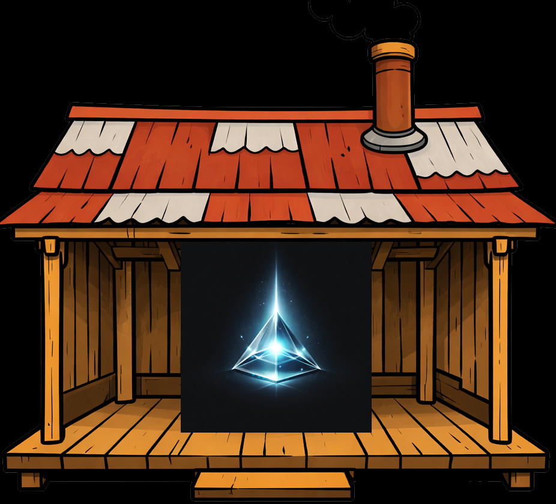

<div align="center">



</div>

# MemShack

> [!IMPORTANT]
> This repository is the C#/.NET migration of the original [MemPalace](https://github.com/milla-jovovich/mempalace) codebase.
> It exists so the MemPalace system can be maintained, packaged, and run as a modern .NET CLI and MCP server while preserving the existing MemPalace storage contracts, tool surface, and migration path for current users.
> This is not a greenfield rewrite with a new data model. Compatibility with the original MemPalace behavior and on-disk data is the reason this repo exists.
>
> [Original readme file](https://github.com/milla-jovovich/mempalace/blob/main/README.md)

MemShack is the .NET implementation of the MemPalace tooling stack.

Repository: [https://github.com/loxsmoke/memshack](https://github.com/loxsmoke/memshack)

It keeps the current MemPalace-compatible defaults:

- config under `~/.mempalace`
- palace data under `~/.mempalace/palace`
- knowledge graph at `~/.mempalace/knowledge_graph.sqlite3`
- collection names `mempalace_drawers` and `mempalace_compressed`

## Quick Start

```powershell
dotnet tool install --global LoxSmoke.Mems

mems init .\ --yes
mems mine .\
mems search "what did we decide?"
mems wake-up
```

`mems mine`, `mems search`, and the other semantic commands use managed local
Chroma by default. On the first real Chroma-backed run, MemShack automatically
downloads the official Chroma CLI into `~/.mempalace/chroma/bin/<rid>/` and
starts it for the current palace.

## Install

### Prerequisites

- .NET 10 SDK or later
- a compatible .NET 10 runtime for running the installed tool

### Install The Tool From A Published Package

Package ID: `LoxSmoke.Mems`

Command name: `mems`

Linux or macOS or Windows global install:

```bash
dotnet tool install --global LoxSmoke.Mems
mems --help
```

### Build And Install Locally From This Repo

```bash
dotnet pack MemShack.slnx
dotnet tool install --global LoxSmoke.Mems --add-source ./src/MemShack.Cli/nuget
mems --help
```

These commands use the package version defined in `src/MemShack.Cli/MemShack.Cli.csproj`.

If `LoxSmoke.Mems` is already installed globally, replace the install step with:

```bash
dotnet tool update --global LoxSmoke.Mems --add-source ./src/MemShack.Cli/nuget
```

For more detailed install modes, see [Tool Installation](docs/tool-installation.md).

## Runtime And Chroma

MemShack keeps the MemPalace storage contract, but its default local runtime is:

- the `mems` .NET tool for the CLI
- the official Chroma CLI, auto-downloaded on first use if needed
- managed local Chroma started automatically per palace

You do not need to configure Chroma manually for the default local flow.

If you want to override that default, MemShack also supports:

- `chroma_url`
  Use an already-running external Chroma server.
- `chroma_binary_path`
  Point at a specific Chroma executable on disk.
- `vector_store_backend: compatibility`
  Force the legacy JSON compatibility store instead of Chroma.

If you need to stop the managed local Chroma process for a palace explicitly,
MemShack keeps a C#-only helper command:

```powershell
mems --palace C:\path\to\palace shutdowndb
```

That command does not exist in the original Python CLI. It is an intentional
MemShack addition.

## MCP And Editor Integration

For MCP-enabled tools, start with:

```powershell
mems mcp
```

That prints the exact `dotnet run --project ...` command for the current repo
checkout and optional `--palace` override. Today, the MCP server is documented
and wired as a repo-checkout workflow rather than a separate packaged server
binary.

Related setup helpers:

- `mems mcp`
  Prints the current MCP server command.
- `mems hook`
  Prints or exports Bash hook assets for Claude Code and Codex.
- `mems instructions`
  Prints or exports repo-local instruction assets.
- `integrations/openclaw/SKILL.md`
  Repo-local OpenClaw / ClawHub skill metadata and setup notes for the current .NET + MCP flow.

More setup docs:

- [MCP Setup](docs/mcp-setup.md)
- [Hooks](hooks/README.md)
- [Instructions](instructions/README.md)
- [Plugin Metadata](plugins/memshack/README.md)
- [OpenClaw Skill](integrations/openclaw/SKILL.md)

## Common Commands

```powershell
mems init <dir> [--yes]
mems mine <dir>
mems search <query>
mems dedup [--dry-run]
mems migrate [--dry-run]
mems status
mems wake-up
mems compress
mems repair
mems split <dir>
mems mcp
mems hook
mems instructions
mems shutdowndb
```

Use `--palace <path>` when you want to point the CLI at a different palace directory.

`mems dedup` uses a similarity threshold from `0` to `1`, where higher is stricter. This is intentionally different from the latest upstream Python `dedup`, which documents Chroma cosine distance.

## Versioning And Releases

MemShack does not try to mirror every upstream Python version bump or README
change.

The product-significant things we track and document here are:

- storage and migration compatibility
- CLI and MCP behavior
- runtime dependencies such as Chroma and SQLite
- parity-relevant feature additions or intentional deviations

The NuGet package version for `LoxSmoke.Mems` is therefore independent from the
Python MemPalace package version. Upstream benchmark-marketing churn, badge
changes, and release-only metadata updates are not copied over automatically
unless they materially affect MemShack users.

## Migration Notes

If you are moving from the Python MemPalace implementation, start here:

- [Migration Guide](docs/migration-guide.md)
- [MCP Setup](docs/mcp-setup.md)
- [Tool Installation](docs/tool-installation.md)
- [Palace2Shack Validation Report](docs/validation/palace2shack-validation-report.md)
